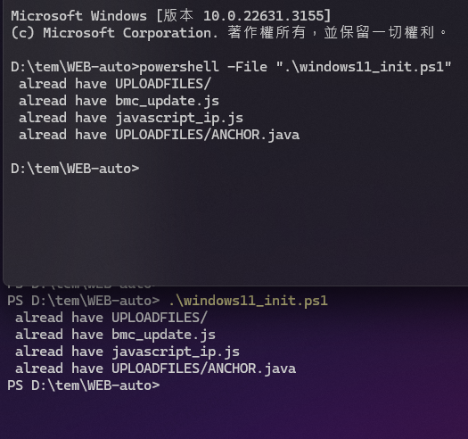

# Consensus
This is an automatic test BMC written using playwright

The file `dev_record.md` is all my development process
1. development process
2. problems encountered and solve them

+ The folder `note/` put all my test code or development stuff etc.  📜📄📑📚🧾🗒️📝
+ The folder `pic/` put all mp4 mp3 gif png etc. 🎬

[set playwright environment](http://sd20-server.aewin.com:3000/_67u42-XQvisBUMef1VGeQ)

-------------------------------------------------------------------------------
-------------------------------------------------------------------------------

# ❗necessary file ( developer  have to do ) ❗
❗❗❗❗❗❗❗🧬🧬🧬🧬🧬
### Linux
execute
`./auto_created_env.sh`
I have already refactored the entire system. For the previous versions,
I only continued the concept and added the prefix "old."
They are almost forgotten (deprecated). If you want to see the previous versions,
you can take a look. As for why I refactored, it's because they were difficult to maintain.


~~i've noticed that every time i write code, it feels like playing a game where fate and opportunity coexist.~~
~~So when I look back after a month, i often find it hard to understand what i wrote.~~
~~i've humorously named these phases "Newbie Era" and "Victorian Era."~~

### windows
+ Use **powershell** : `.\windows11_init.ps1`
```powershell
PS D:\tem\WEB-auto> .\windows11_init.ps1
```
+ if use *CMD* :
```cmd
powershell -File ".\windows11_init.ps1"
```


-------------------------------------------------------------------------------
-------------------------------------------------------------------------------

# auto-test  #
### Linux
```bash
./auto_test.sh
```

-------------------------------------------------------------------------------
-------------------------------------------------------------------------------

# [progress](./agenda.md)

-------------------------------------------------------------------------------
-------------------------------------------------------------------------------

###  how to use burn BMC repeatedly (only LINUX)
use command
```bash
./updateBMC.sh
```
[see more details](http://sd20-server.aewin.com:3000/7d_073JjTEiIFLKFqkMNsw)

-------------------------------------------------------------------------------
