-------------------------------------------------------------------------------
created	:	Thu Jul 11 16:08:27 CST 2024
date	:	Fri Jul 12 16:47:47 CST 2024

-------------------------------------------------------------------------------
#  Developer Manual -- Required   #
1. only support AST2600
2. BMC have the  network
Later, the author will mention which features are commonly used.
5. support Linux

### featrue ###
- `UPLOADFILES/` is put update bmc file !!
  + (if you want update BMC with WEBUI interface put update file)
- every feature has already been modularized.

## some_file_function   ##
`auto_created_env.sh` 	--> this is first automatically generated some file
`auto_ip.sh` 			--> this can only set (BMC ID address)
`auto_delete_folder.sh` --> This is to delete the previous result before each execution
`auto_update_bmc.sh` 	--> only test function : update bmc!!

## result (automatically generated) ##
+ Two folders will be automatically generated, named `result` and `screenshot`
> resutl : put ipmitool generate txt file

> screenshot : put playwright screenshot file (png)

[orgiain](https://gitmind.com/app/docs/fj3rwaqz)
