-------------------------------------------------------------------------------
created	:	Fri Jul 12 15:19:55 CST 2024
date	:	Fri Jul 12 16:48:04 CST 2024

-------------------------------------------------------------------------------

# update_BMC_WEBUI #
Here are the three states that an update BMC can have
1. no update
2. update one time
   + one file	:	directory update file (no input)
   + more than one : choose which file update
3. loop update
   - one file	:	error
   + more than one : choose which file update

According to the explanation above, when the user enters a number,
it represents the number of times to update
(the original design was for back-and-forth burning)

There will be a file section later, and it needs to be placed in `UPLOADFILES/`

If there are more than 1 file to update,
the user will be prompted to input the files to update.
Then, I mimic the backend approach to place the data into `bmc_update.js`

[origin_pic](https://gitmind.com/app/docs/f2jy5frs)
