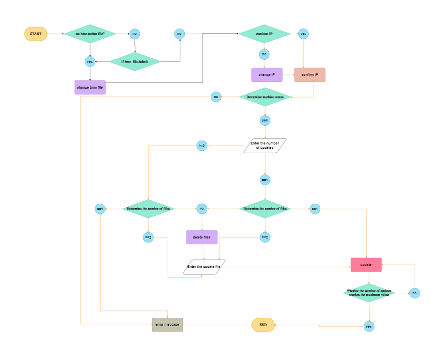
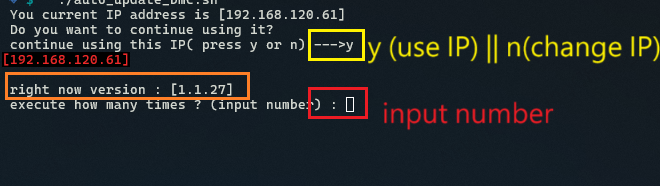
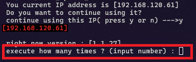

-------------------------------------------------------------------------------
created	:	Mon Jul 15 09:48:32 CST 2024
date	:	Mon Jul 15 11:42:34 CST 2024

-------------------------------------------------------------------------------

# graph overview #



#  put update file #
======================

`/../UPLOADFILES/` Put the files to be updated into the folder rule:
1. There can only be two files
```bash
UPLOADFILES/
├── ANCHOR.java
└── IS-5121_v1.0.34N.ima
```

# check initial IP #
====================

The initial IP will appear on the first line
Check if it is the IP you need to use

The first step is to check the IP address first.
The first line will say the initial IP
If user want to continue using
then press `y`

### input IP address ###
but if user need to change IP address
need to press `n`
and then --> just input you IP address
( need to double check)


> The dev : I put all the input from the user into `--->`

There will be a place to enter the IP

Next, you need to confirm whether the IP is correct.

> Designed with only simple text
> Instead of confirming the password and entering it again

will eventually appear again ip =====> x.x.x.x
confirmation message

### if bmc no connecting ###
**the dev: I also use the Playwright approach to modify the default password behavior**
(but in Playwright, if there’s an issue, it might [freeze directly](../dev_record.md#if_playwright_error_freeze)),
so you’ll need to use `Ctrl+C` to cancel everything

# last how many times to burn in BMC #
The last step is to decide how many times you want to burn (input number)

