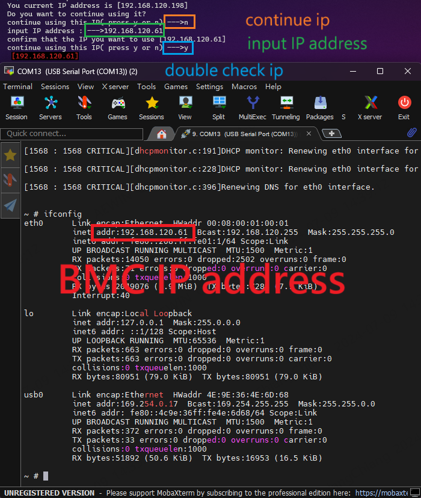

-------------------------------------------------------------------------------
created	:	Tue Jul  9 14:27:49 CST 2024
date	:	.

-------------------------------------------------------------------------------
this use `./auto_test.sh`
```bash
You current IP address is [192.168.120.61]
Do you want to continue using it?
continue using this IP( press y or n) --->y		### input
[192.168.120.61]
right now version : [1.1.25]
execute how many times ? (input number) : 1		### input
```


##  automatically generate  ##
> have two folder (screenshot && resutl)
1. screenshot --> have playwright screenshot png file
2. result  --> ipmitool get infomation (It's include BBU and SD10 test)
```bash
../result/
├── TEST_RECORD
│   ├── Log_Reports
│   └── Sensors
│       ├── FAN.txt
│       ├── PSU.txt
│       ├── TEMPERATURE.txt
│       ├── sdr.txt
│       └── voltage.txt
├── bbu
│   ├── fan.txt
│   ├── sdr.txt
│   ├── vbat.txt
│   └── version.txt
├── lan_print.txt
├── mc_info.txt
├── sel_clear_0.txt
├── sel_elist_0.txt
├── sel_elist_check_clear.txt
├── sel_elist_event.txt
├── sel_info.txt
├── sensor.txt
├── user_list_0.txt
├── user_list_1.txt
├── watchdog.txt
└── watchdog_reset.txt

4 directories, 21 files

../screenshot/
├── advanced_log.png
├── audit-log.png
├── bbu.png
├── sensor.png
└── settings
    ├── date_time.png
    ├── dying_gasp.png
    ├── external_user_services
    │   ├── active
    │   │   ├── active_directory.png
    │   │   ├── general_active_directory.png
    │   │   └── rolegroup_active_directory.png
    │   ├── external_user.png
    │   ├── ldap
    │   │   ├── general.png
    │   │   ├── ldap.png
    │   │   └── rolegroup_ldap.png
    │   └── radius
    │       ├── advanced_radius.png
    │       ├── general_radius.png
    │       └── radius.png
    ├── firewall
    │   ├── firewall.png
    │   ├── general_firewall_settings
    │   │   ├── add_firewall_settings.png
    │   │   ├── existing_firewall_settings.png
    │   │   └── general_firewall_settings.png
    │   ├── ip_firewall
    │   │   ├── add_ip_rule.png
    │   │   ├── ip_firewall.png
    │   │   └── ip_rules.png
    │   └── port_firewall
    │       ├── add_port_rule.png
    │       ├── port_firewall.png
    │       └── port_rules.png
    ├── ipmi_interfaces
    │   └── ipmi_interfaces.png
    ├── log
    │   ├── SEL_log_settings_policy.png
    │   ├── advanced.png
    │   └── log.png
    ├── media
    │   ├── mdeia.png
    │   ├── media-active_redirections.png
    │   ├── media-general.png
    │   ├── media-instance.png
    │   └── media-remote_session.png
    ├── mouse.png
    ├── network
    │   ├── dns.png
    │   ├── ip.png
    │   ├── link.png
    │   └── network.png
    ├── pam_order.png
    ├── pef
    │   ├── alert_policies.png
    │   ├── event_filters.png
    │   ├── lan_destinations.png
    │   └── pef.png
    ├── services.png
    ├── smtp.png
    ├── ssl
    │   ├── generate_ssl.png
    │   ├── ssl.png
    │   ├── upload_ssl.png
    │   └── view_ssl.png
    ├── users
    │   ├── channel1.png
    │   ├── channel2.png
    │   └── channel7.png
    └── video
        ├── auto
        │   ├── auto_video_setting.png
        │   ├── pre_event.png
        │   ├── remote_storage.png
        │   └── trigger_settings.png
        ├── sol
        │   ├── sol_configurations.png
        │   ├── sol_remote_storage.png
        │   ├── sol_setting.png
        │   └── sol_trigger_settings.png
        └── video.png

19 directories, 63 files
```
